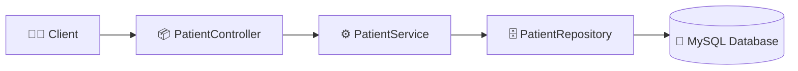

# EHR System Backend
🏥 EHR System Backend
https://img.shields.io/badge/Java-17-blue  
https://img.shields.io/badge/SpringBoot-3.0-green  
https://img.shields.io/badge/Docker-Compose-orange  
https://img.shields.io/badge/MySQL-8.0-lightblue

HIPAA-compliant Electronic Health Record (EHR) backend built with Java, Spring Boot, and microservices architecture. Demonstrates secure patient data management, scalable API design, and cloud-ready deployment. Includes REST endpoints, database integration, and monitoring tools to showcase enterprise-grade healthcare application development.

## 🚀 Features
- RESTful APIs for patient records and appointments
- MySQL integration
- Swagger/OpenAPI documentation
- Unit testing with JUnit and Mockito

## 📂 Repository Structure
```text
ehr-system-backend/
 ├── src/
 │    └── main/
 │         └── java/com/ehr/patient/
 │              ├── PatientController.java      # REST API endpoints
 │              ├── PatientService.java         # Business logic
 │              ├── PatientRepository.java      # JPA repository
 │              ├── Patient.java                # Entity with validation
 │              └── GlobalExceptionHandler.java # Centralized error handling
 │
 │         └── resources/
 │              ├── application.properties      # DB + app configs
 │              └── static/                     # (optional) static files
 │
 ├── target/                                    # Compiled output (generated)
 ├── Dockerfile                                 # Build Spring Boot app image
 ├── docker-compose.yml                         # Run app + MySQL together
 ├── pom.xml                                    # Maven dependencies & build
 └── README.md                                  # Project documentation

## 🚀 Quickstart with Docker Compose
```bash
# Clone the repo
git clone https://github.com/yourusername/ehr-system-backend.git
cd ehr-system-backend

# Build and run with Docker Compose
docker-compose up --build

## 🧩 Error Handling Example
```json
{
  "timestamp": "2026-05-11T06:20:00",
  "status": 404,
  "error": "Not Found",
  "message": "Patient not found"
}


🧩 Architecture Diagram
mermaid
flowchart LR
    Client[👩‍💻 Client] --> Controller[📦 PatientController]
    Controller --> Service[⚙️ PatientService]
    Service --> Repository[🗄️ PatientRepository]
    Repository --> DB[(💾 MySQL Database)]
🔄 Workflow
Client sends request (e.g., POST /api/patients).

Controller validates input (@Valid).

Service applies business logic.

Repository persists data with JPA.

Database stores patient records.

GlobalExceptionHandler returns clean JSON errors if something fails.

🛡️ Error Handling Example
json
{
  "timestamp": "2026-05-11T06:20:00",
  "status": 404,
  "error": "Not Found",
  "message": "Patient not found"
}
## 🏗️ Box‑Style Architecture Diagram
+----------------------+
|     Client Requests  |
|  (Frontend / Postman)|
+----------+-----------+
           |
           v
+----------------------+
|   Patient Controller |
|   REST API Endpoints |
+----------+-----------+
           |
           v
+----------------------+
|    Patient Service   |
|     Business Logic   |
+----------+-----------+
           |
           v
+----------------------+
|  Patient Repository  |
|     JPA / Hibernate  |
+----------+-----------+
           |
           v
+----------------------+
|   MySQL Database     |
|  EHR System Storage  |
+----------------------+
```
## 🧩 Architecture Diagram (Mermaid)

## 📌 Future Work
- Add authentication & role‑based access.
- Integrate logging & monitoring (Prometheus/Grafana).
- CI/CD pipeline with GitHub Actions.
- Extend to multiple microservices (appointments, billing, etc.).


